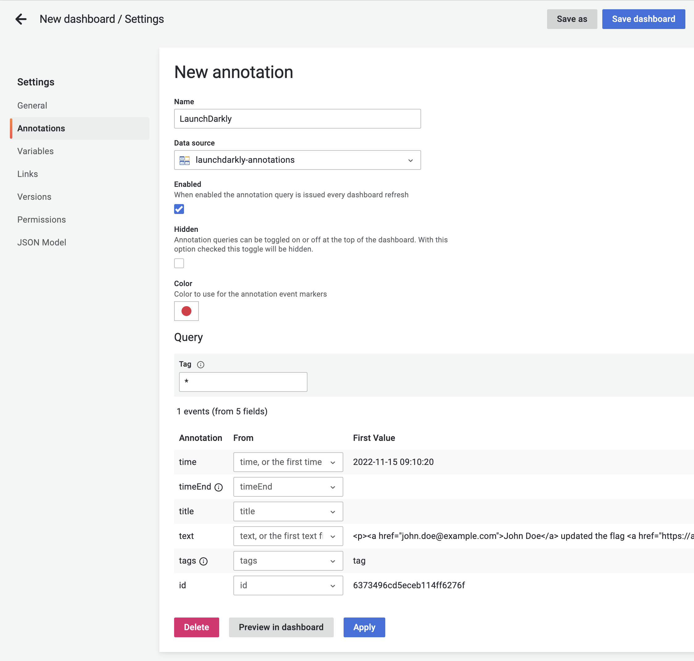
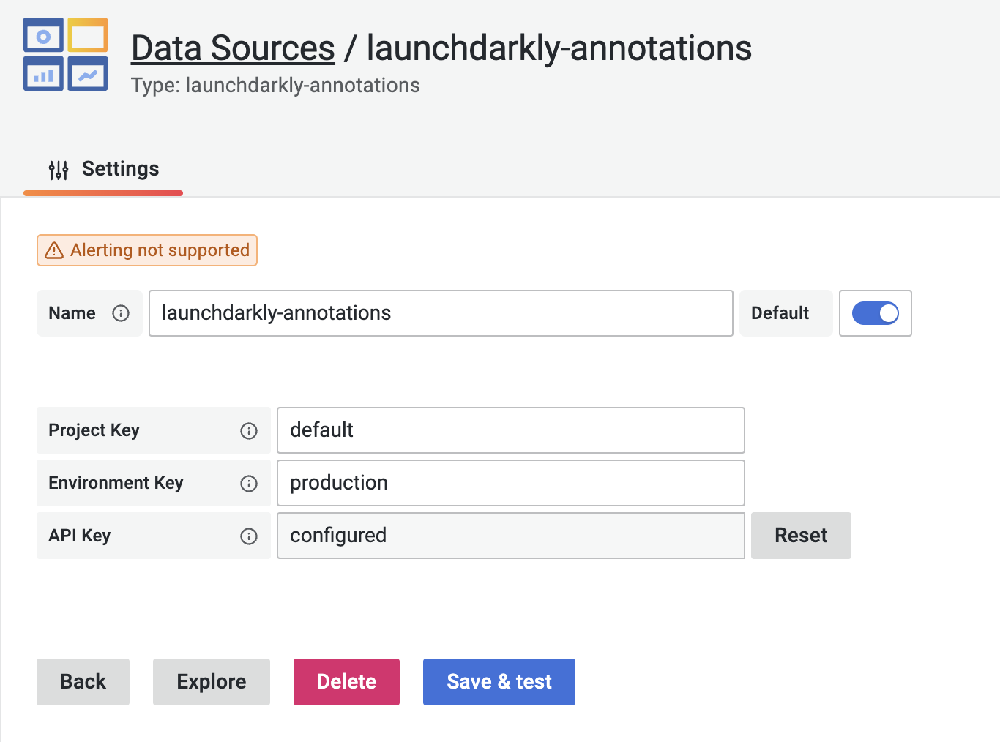

# LaunchDarkly Plugin for Grafana

A Grafana Data Source Plugin for displaying LaunchDarkly flag changes as annotations.

Please see current limitations and issues on [GitHub](https://github.com/EMnify/grafana-plugin-launchdarkly/issues).
